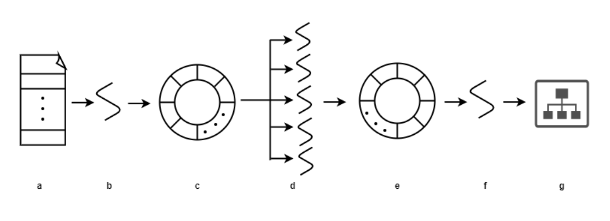

# Configuration
This folder include configurations for kafka shipping (kafka.cfg),
multi-thread processing (multithread.cfg), relational database (postgresdb.cfg),
and graph database (neo4j.cfg).

# Kafka
Enterprise-wide audit records are collected into a Kafka broker and then fetched by
the consumer threads. The consumer thread buffers the records in a Kafka topic,
organizes the out-of-order records based on their sequence number, reduce noisy
records, and translates them into a KG.

### kafka.cfg:
An example of kafka configuration is as follows:
``` bash
broker = "localhost:9092";
topic = "["log"]";
group_id = "auditbeat";
batch_size = "500";
batch_tmout = "1";
```
- `Broker` and `topic` define [kafka broker and topic](https://www.cloudkarafka.com/blog/part1-kafka-for-beginners-what-is-apache-kafka.html).
- `Group_id` defines group id for a consumer. 
- `batch_size` and `batch_tmout` controls the throughput of record processing. We
  collect audit records through batch processing. We form a batch if its size reaches
  `batch_size` or the consumer has waited for `batch_tmout` seconds.

### Construct KG through Kafka
``` bash
# ../audit/test stores metainfo (i.e., procinfo, socketinfo, and fileinfo)
./driverkafka -trace ../audit/test
```

# Multithread
An overview of our multithread-based KG construction design is as follows:


### multithread.cfg:
An example of multithread configuration is as follows:

```
batch_size = "1000";
batch_repo_size = "500";
graph_repo_size = "500";
```
- `Batch size` defines the number of audit records for KG construction per thread per time.
- `Batch repo` (c) contains 500 batches, where each batch is a set of 1000 audit records. 
- `Graph repo` (e) contains 500 knowledge subgraphs, where each subgraph is built on 1000 audit records. 

Note: The number of threads for multithread-based KG construction (d) is defined by user input with `-multithread xx`.

### Construct KG with multiple threads
``` bash
./driverdar -dataset e3/trace -trace ../data/darpa/e3/trace/b/ta1-trace-e3-official-1.json -multithread 8
```

# Postgresql
ShadeWatcher supports storing/loading log data to/from a relational database (Postgresql).

### postgresdb.cfg:
An example of postgresdb configuration is as follows:
```
username = "postgres";
host = "127.0.0.1";
password = "11111";
dbname = "postgres";
port = "5432";
batch_node = "1000";
batch_edge = "5000";
```

### Storing log data to Postgresql database:
Specify the raw log data with -trace option, schema name with -dataset, and also storing database flag with -storetodb. For example:
```bash
./driverdar -dataset e3_trace -trace ../data/darpa/e3/trace/b/ta1-trace-e3-official-1.json -storetodb dbtest.cfg
```

### Loading log data from Postgresql database:
If the log data has already been stored to the database before, we can retrieve
them from the database, e.g.,:
```bash
./driverdar -dataset e3_trace -loadfromdb all dbtest.cfg
./driverdar -dataset e3_trace -loadfromdb 0,1 dbtest.cfg
```

# Neo4j
ShadeWatcher supports storing log data to a graph database (Neo4j) for graph visualization.

### neo4jdb.cfg:
An example of neo4jdb configuration is as follows:
```bash
url = "neo4j://neo4j:1@localhost:7687";
batch_edge = "10";
batch_node = "10";
```